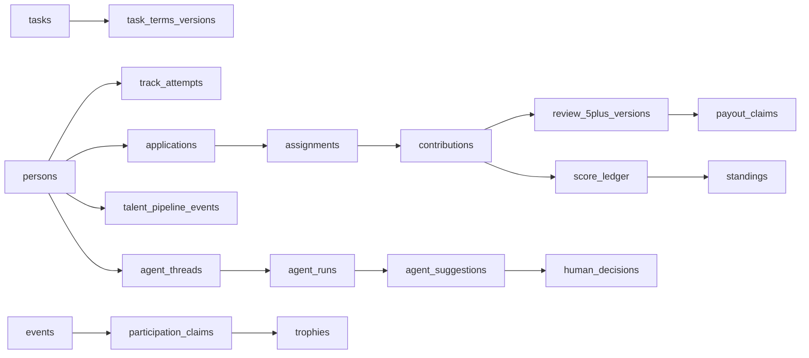

# Доменная модель и демонстрационные персоны

Документ описывает физическую модель MVP. Все изменяемые сущности имеют `version`, `data_origin`, `status`, `provenance`, `payload`, автора и UTC-время. Исправления значимых фактов создают новую версию или компенсирующую запись. `audit_entries` и `domain_events` защищены PostgreSQL-триггером от `UPDATE` и `DELETE`.

## Контексты

| Контекст | Ответственность | Основные связи |
|---|---|---|
| Identity | человек, рабочие роли, сессии и согласия | `persons` — корень прав и видимости |
| Development | направления, roadmap, курсы и streak | попытки и завершения принадлежат человеку |
| Work | R&D-задачи, условия, заявки, назначения и вклад | принятая версия условий фиксируется до работы |
| Reward | 5+, коэффициенты и начисления | review связан с версией личного вклада |
| Recognition | сезон, ledger, место, диплом, трофей и оффер | score — append-only основание, оффер хранится отдельно |
| Ecosystem | программы, события и внешние источники | внешний факт связывается по provider/external ID |
| Assist | agent threads, runs, suggestions и решения человека | suggestion не является доменным решением |
| Insight | аудит, события и снимки метрик | записи создаются в транзакции изменения |

## Demo personas

| Ключ | Имя | Роль | Сценарий |
|---|---|---|---|
| `participant-alex` | Алекс Речной | участник | взрослый учащийся без обязательного вуза, оплачиваемая задача и рейтинг |
| `participant-maria` | Мария Северова | участник | второе направление и submitted-вклад |
| `participant-igor` | Игорь Лесной | участник | смена профессиональной пробы без штрафа |
| `mentor-elena` | Елена Наставник | ментор | evidence review и человеческое решение |
| `customer-roman` | Роман Заказчик | заказчик | восемь R&D/MVP-задач с paid/unpaid условиями |
| `manager-olga` | Ольга Руководитель | руководитель | агрегированная польза R&D |
| `hr-nina` | Нина HR | HR | только consented и проверяемые факты |
| `operator-pavel` | Павел Оператор | оператор | проверка источников и спор по баллам |

Seed использует UUIDv5 namespace и `DEMO_SEED_VERSION`. Каждый объект маркируется `data_origin=demo_seed` и `provenance.synthetic=true`; имена, события, ссылки, суммы и достижения вымышлены.

## Managed tables

Этот блок проверяется автоматическим тестом против `Base.metadata`.

<!-- tables:start -->
- `acceptances`
- `actor_roles`
- `agent_feedback`
- `agent_messages`
- `agent_runs`
- `agent_suggestions`
- `agent_threads`
- `appeals`
- `applications`
- `artifacts`
- `case_decisions`
- `assignments`
- `audit_entries`
- `compensation_terms`
- `consents`
- `contributions`
- `course_track_links`
- `courses`
- `credentials`
- `domain_events`
- `enrollments`
- `events`
- `external_sources`
- `human_decisions`
- `learning_days`
- `metric_snapshots`
- `milestones`
- `model_policies`
- `offer_evidence`
- `operations_cases`
- `participation_claims`
- `payout_claims`
- `persons`
- `programs`
- `projects`
- `provider_records`
- `rating_policies`
- `review_5plus_versions`
- `review_rubrics`
- `roadmap_versions`
- `score_ledger`
- `seasons`
- `sessions`
- `settlement_attempts`
- `standings`
- `talent_pipeline_events`
- `task_terms_versions`
- `tasks`
- `track_attempts`
- `tracks`
- `trophies`
- `visibility_settings`
<!-- tables:end -->
