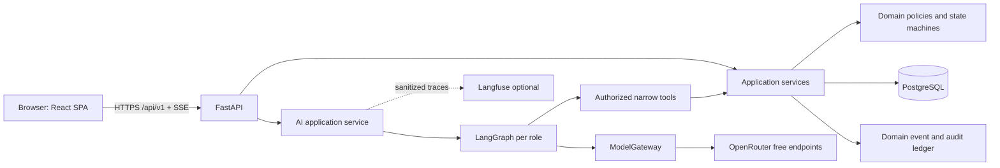

# Design

## Context

Репозиторий новый: в нём нет существующего приложения, схемы данных, auth-провайдера или API, поэтому адаптация legacy-кода не требуется. Бизнес-мотивация определена в `proposal.md`, наблюдаемое поведение — в 17 delta specs этого change. Word-документ остаётся материалом согласования; после создания change authoritative source для coding agents — Markdown OpenSpec.

Проект должен запускаться локально и одним Docker-образом в Railway, использовать PostgreSQL и настоящий OpenRouter для AI, но демонстрировать бизнес-сценарии на явно маркированных моковых данных. Бесплатные модели имеют низкие и изменчивые лимиты, поэтому AI не может быть обязательной зависимостью основного пути. Ключ OpenRouter уже предоставлен для разработки, но SHALL существовать только в локальном `.env` и Railway Variables и никогда не попадать в Git или образ.

Технические решения учитывают следующие ограничения:

- Python остаётся владельцем API, доменных инвариантов, RBAC, денег, рейтинга и агентных инструментов.
- AI работает только с публичными или синтетическими данными MVP; `INTERNAL_BUSINESS`, `SENSITIVE_PERSONAL` и `SECRETS` блокируются до отдельного решения владельца данных.
- Все consequential actions подтверждает человек через обычный application service; модель не имеет прямого доступа к БД и write-инструментам Buddy.
- Бесплатный OpenRouter может предоставлять около 50 запросов в день и не предназначен для производственного SLA, поэтому применяются квоты, graceful degradation и fake gateway для тестов.
- Railway обнаруживает корневой `Dockerfile`; публичный сервис должен слушать `0.0.0.0:$PORT`, иметь `/health/live` и `/health/ready`.

## Goals / Non-Goals

**Goals:**

- Поставить демонстрируемый end-to-end MVP для шести рабочих ролей в одном развёртывании.
- Сделать спецификации трассируемыми: requirement/scenario → task → automated test → API/UI behavior.
- Отделить доменные правила от UI, ORM, OpenRouter и LangGraph так, чтобы провайдеры заменялись адаптерами.
- Сделать Buddy реальным сразу, а помощников ментора и оператора — реальными черновиками при включённых flags.
- Обеспечить безопасную работу без AI, без Langfuse и при исчерпанном лимите бесплатной модели.
- Использовать правдоподобные моковые пользователи, проекты, курсы, события, рейтинг и выплаты, явно помеченные `demo`.
- Подготовить один воспроизводимый Docker/Railway путь и локальную разработку через `uv`.

**Non-Goals:**

- Реальный перевод денег, банковские реквизиты и интеграция с платёжной системой.
- Корпоративный SSO, кадровая система, API МАЯКОВ, LMS Сбера и юридически значимая электронная подпись.
- Автоматическая публикация оценки, оффера, трофея, диплома или кадрового решения моделью.
- Production SLA, горизонтальное масштабирование, микросервисы и отдельная data platform.
- Командное распределение общего бюджета, публичный зал славы курсов и отдельные кабинеты ролей второй очереди.
- Передача реальных закрытых R&D-материалов бесплатным внешним моделям.

## Decisions

### 1. Архитектура: модульный монолит и один deployable

Выбирается модульный монолит: один FastAPI backend, один React SPA bundle, одна PostgreSQL БД. Frontend собирается отдельной стадией Docker и раздаётся FastAPI как статические файлы; `/api/v1/*` и `/agents/*` обслуживаются Python. Это минимизирует стоимость Railway, CORS-конфигурацию и операционную сложность, сохраняя модульные границы для возможного выделения worker или analytics позже.



Альтернативы: микросервисы отклонены как преждевременные; Streamlit отклонён из-за сложного RBAC и ролевой навигации; полностью server-rendered UI отклонён, потому что интерактивные roadmap, графики, роль-переключатель и SSE-чат проще поддерживать компонентно.

### 2. Стек и версии

- Python production baseline: `>=3.13,<3.15`; Docker фиксирует конкретный patch image после dependency smoke. Placeholder `>=3.14` в исходном `pyproject.toml` будет заменён совместимым диапазоном.
- Backend: FastAPI, Pydantic 2, SQLAlchemy 2 async, Alembic, `asyncpg`, `httpx`, `structlog`.
- AI: `langgraph`, `langchain`, `langchain-openrouter` и `langfuse`; прямые зависимости фиксируются `uv.lock`, production не использует `latest`.
- Frontend: React, TypeScript, Vite, React Router, TanStack Query; диаграммы — Recharts, формы — React Hook Form + schema validation.
- Tests: pytest, pytest-asyncio, HTTPX ASGI client, Hypothesis для денежных инвариантов, Vitest/Testing Library, Playwright для критических journeys.
- Quality: Ruff format/lint, Pyright, ESLint, TypeScript strict, secret scan и OpenSpec strict validation.

`langchain-openrouter` имеет beta-статус, поэтому оборачивается собственным `ModelGateway`; контрактный smoke покрывает async, streaming, tool calling, structured output, usage и фактический model ID.

### 3. Структура репозитория

```text
Sber-platform/
├─ src/impulse/
│  ├─ api/v1/                 # routers, request/response schemas, auth context
│  ├─ application/            # use cases and transaction boundaries
│  ├─ domain/                 # entities, value objects, policies, state machines
│  ├─ infrastructure/         # SQLAlchemy, repositories, integrations, audit
│  ├─ ai/
│  │  ├─ gateway/             # ModelGateway and OpenRouter adapter
│  │  ├─ graphs/              # buddy, mentor, operator, customer
│  │  ├─ tools/               # allowlisted application-service wrappers
│  │  ├─ prompts/             # versioned prompts
│  │  ├─ guardrails/          # classification, redaction, output validation
│  │  ├─ evaluation/          # fixtures, datasets, runners
│  │  └─ telemetry/           # optional Langfuse callbacks
│  ├─ analytics/              # event definitions and metric queries
│  ├─ bootstrap/              # settings, app factory, dependency wiring, seed
│  └─ main.py
├─ frontend/src/              # React application and role workspaces
├─ migrations/                # Alembic versions
├─ tests/                     # domain, API, permissions, agents, evaluation
├─ openspec/                  # source-of-truth SDD artifacts
├─ Dockerfile
├─ railway.toml
├─ pyproject.toml
├─ uv.lock
└─ .env.example               # names only, never values
```

Импорты идут внутрь: `api` и `infrastructure` зависят от `application/domain`; domain не импортирует FastAPI, SQLAlchemy, LangChain или OpenRouter.

### 4. Authentication, demo mode и RBAC

Так как корпоративный auth не предоставлен, MVP использует `AuthProvider` с двумя реализациями:

- `DemoAuthProvider`: предсозданные personas, вход одной кнопкой и подписанная HttpOnly cookie-сессия; активен только при `DEMO_MODE=true`.
- `HeaderTestAuthProvider`: только tests, принимает actor fixture без сетевого входа.

В production-like режиме без настроенного реального auth startup SHALL завершаться ошибкой, если `DEMO_MODE=false`. Роль-переключатель доступен только demo-пользователю, у которого эти роли реально назначены в БД; изменение UI-роли не выдаёт новые permissions.

`ActorContext` содержит `person_id`, active role, scopes, tenant/program, consents, locale, timezone и correlation ID. Он строится сервером из сессии. Каждый application service проверяет роль и отношение к объекту повторно. Для недоступного или неизвестного объекта API возвращает одинаковый `404 RESOURCE_NOT_FOUND`, чтобы не раскрывать существование чужой записи.

Матрица MVP:

| Роль | Читает | Меняет |
|---|---|---|
| Участник | свой путь, публичные каталоги, свои назначения/выплаты | свои tracks, заявки, вклады, согласия, споры |
| Ментор | назначенные задачи и доказательства | черновик/подписанный review в своём scope |
| Заказчик | собственные задачи, заявки, бизнес-артефакты | бриф, версия условий, business acceptance |
| Руководитель | агрегаты собственной команды | только объекты, где отдельно имеет customer permission |
| HR | consented portfolio и проверяемые факты | приглашение, интервью, подтверждение оффера |
| Оператор | операционные дела и нужные зависимости | модерация, support assignment, verification, dispute decision |

### 5. Data model и правила хранения

Все основные таблицы используют UUID/ULID, UTC timestamps, `version` для optimistic concurrency и `created_by`. Денежные значения хранятся как `NUMERIC` плюс ISO currency; binary float запрещён. Свободный текст, visibility и provenance разделены, чтобы проекции не вытекали через сериализацию ORM.

Основные агрегаты:

- Identity: `persons`, `actor_roles`, `sessions`, `consents`, `visibility_settings`.
- Development: `tracks`, `track_attempts`, `roadmap_versions`, `milestones`, `courses`, `course_track_links`, `enrollments`, `learning_days`.
- Work: `projects`, `tasks`, `task_terms_versions`, `applications`, `assignments`, `contributions`, `artifacts`, `acceptances`, `appeals`.
- Reward: `review_rubrics`, `review_5plus_versions`, `compensation_terms`, `payout_claims`, `settlement_attempts`.
- Recognition: `seasons`, `rating_policies`, `score_ledger`, `standings`, `credentials`, `trophies`, `offer_evidence`.
- Ecosystem: `events`, `programs`, `participation_claims`, `external_sources`, `provider_records`.
- Assist: `agent_threads`, `agent_messages`, `agent_runs`, `agent_suggestions`, `human_decisions`, `agent_feedback`, `model_policies`.
- Insight: `domain_events`, `audit_entries`, `metric_snapshots`.

Идемпотентность обеспечивают уникальные бизнес-ключи: `(actor_id, client_request_id)` для agent run, `(assignment_id, contribution_version, terms_version)` для payout claim, `(season_id, source_type, source_id, rule_id)` для score entry, `(provider_id, external_id)` для внешнего факта. Исправление создаёт новую версию или компенсирующую запись, но не переписывает исторический факт.

### 6. State machines и транзакционные границы

Переход выполняет application service в одной транзакции: загружает агрегат с expected version, проверяет actor/object permission и policy version, меняет состояние, пишет audit/domain event и commit. UI никогда не обновляет статус прямым PATCH произвольного поля.

- Track attempt: `draft → active ↔ frozen`. Активация третьего требует атомарно заморозить выбранный active track; completed milestones принадлежат attempt/version и сохраняются.
- Enrollment: `available → in_progress → completion_reported → verified | rejected`. Только `verified` может стать основанием ledger.
- Task: `draft → moderation → published → staffed → in_progress → submitted → accepted | revision_requested | disputed → closed`. `published` требует support mode и полную terms version.
- Review 5+: `draft → proposed → human_confirmed → published → disputed → corrected | upheld → frozen`. На contribution version действует одна current финальная версия.
- Payout: `not_applicable | pending_acceptance → calculated → approved → sent_to_payment_system → paid | failed | reversed`. В MVP payment adapter — демонстрационный; статус UI явно содержит `demo`.
- Season: `scheduled → open → closing → frozen`. Документ выдаётся после `frozen`; поздняя коррекция создаёт `superseded`/новую версию.
- External evidence: `reported → awaiting_verification → verified | rejected → revoked?`.
- Agent run: `created → running → awaiting_human | completed | failed | cancelled`; suggestion: `draft → pending_decision → approved | edited | rejected | stale`.

Недопустимый переход возвращает `409 INVALID_STATE_TRANSITION`; несовпавшая версия — `409 STALE_VERSION`; повтор с тем же idempotency key возвращает исходный результат. Agent suggestion не входит в транзакцию consequential action: человек просматривает предложение, а доменный command заново проверяет evidence и version.

### 7. Деньги, 5+ и рейтинг исполняются детерминированным Python-кодом

`CompensationTerms` — immutable snapshot, принятый при отклике: `paid`, `base_amount_per_assignee`, `currency`, `B_multiplier=1.5`, точный `A_multiplier` в диапазоне `[2,3]`, `quantum`, `rounding_mode`, rubric/policy version и payout condition. Для `unpaid` суммы отсутствуют, а UI не показывает потенциальную премию.

```text
B_total = quantize(base × 1.5, policy quantum, policy rounding)
A_total = quantize(base × published_A_multiplier, policy quantum, policy rounding)
```

Расчёт использует `Decimal`. Он запускается только для принятого персонального вклада и опубликованной человеком оценки. `calculated` означает право по правилам, не перевод. Повторная команда не создаёт второй claim; reversal — отдельная запись.

Review 5+ хранит rubric version, grade, критерии, human-authored explanation, evidence refs, signer, conflict check и contribution version. AI draft хранится отдельно и может быть удалён без изменения review. Для демо используется утверждённая фикстура рубрики, но UI маркирует её «правила пилота».

`ScoreLedger` append-only. Демо-политика сезона задаётся seed-файлом и содержит weights, caps, tie breaker, cohort, diploma thresholds и appeal period. Пересчёт materialized standings воспроизводится из ledger; трофей визуально не равен баллам без rule. Credential имеет opaque verification ID, public projection, `valid/revoked/superseded`, исходную policy version и checksum payload.

До утверждения реальных D01–D10 production-like flags блокируют `paid=true`, открытие season и юридически значимую выдачу; в `DEMO_MODE` сценарии работают на синтетике и визуально обозначены.

### 8. HTTP API contract

Базовый путь — `/api/v1`. Все даты ISO 8601 UTC, списки используют cursor pagination, ошибки имеют единый вид `{code, message, field_errors?, request_id, retryable}`. Опасные записи требуют `Idempotency-Key`; responses с consequential data возвращают `object_version` и `policy_version`.

Ключевые endpoints:

| Область | Endpoints |
|---|---|
| Session | `POST /auth/demo-login`, `POST /auth/logout`, `GET /me`, `POST /me/active-role` |
| Tracks | `GET/POST /me/tracks`, `POST /me/tracks/{id}/freeze`, `POST /me/tracks/{id}/reactivate`, `GET /me/roadmaps/{track_id}` |
| Learning | `GET /bootcamp/courses`, `GET /bootcamp/courses/{id}`, `POST /me/courses/{id}/completion-claims`, `GET /me/streak` |
| Events | `GET /events`, `GET /events/{id}`, `POST /events/{id}/participation-claims` |
| Tasks | `GET /tasks`, `GET /tasks/{id}`, `POST /tasks/{id}/applications`, `GET /me/assignments`, `POST /assignments/{id}/contributions` |
| Portfolio | `GET /me/portfolio`, `PATCH /me/visibility`, `GET /credentials/{verification_id}` |
| Customer | `POST /customer/tasks`, `POST /customer/tasks/{id}/submit`, `POST /customer/tasks/{id}/publish`, `POST /customer/contributions/{id}/accept` |
| Mentor | `GET /mentor/queue`, `GET /mentor/assignments/{id}`, `POST /mentor/reviews/{id}/draft`, `POST /mentor/reviews/{id}/publish` |
| Operations | `GET /ops/cases`, `POST /ops/tasks/{id}/support`, `POST /ops/cases/{id}/decide` |
| HR | `GET /hr/candidates`, `GET /hr/candidates/{id}`, `POST /hr/invitations` |
| Analytics | `GET /analytics/me`, `/mentor`, `/customer`, `/manager`, `/hr`, `/operations` |
| Agents | `POST /agents/buddy/threads`, `POST /agents/buddy/threads/{id}/messages`, `GET/DELETE .../messages`, `POST /agents/*/suggestions`, `POST /agents/suggestions/{id}/decisions`, `POST /agents/runs/{id}/feedback` |

Buddy streaming использует SSE: `run.started`, `message.delta`, `message.completed`, `run.failed`, `run.cancelled`. До клиента проходят только display-safe текстовые delta; tool calls, reasoning и непроверенные structured fields не стримятся. `client_request_id` делает сообщение идемпотентным.

OpenAPI генерируется из Pydantic и сохраняется snapshot-тестом. Frontend client генерируется либо типизируется по OpenAPI, чтобы поля денег и версий не расходились.

### 9. UI shell и доступность

Общий layout: левая role-aware навигация, верхняя панель с активной demo persona/ролью, уведомлениями и быстрым поиском, основная область, контекстная правая панель Buddy только у участника. На ширине меньше 1024 px навигация становится drawer; таблицы имеют карточный fallback.

Design tokens: нейтральная светлая основа, зелёный акцент, отдельные цвета `verified/reported/failed/demo`; никакой смысл не передаётся только цветом. Все hover-tooltip доступны по keyboard focus и содержат текстовый trigger. Modal trap, skip link, aria-live для чата, контраст WCAG AA и reduced motion входят в acceptance.

Общие состояния каждого экрана: loading skeleton; empty state с конкретным следующим действием; restricted с объяснением без раскрытия объекта; awaiting verification; stale external source; recoverable error; offline/AI unavailable. Mock/fake records имеют постоянный badge «Демо-данные».

### 10. Кабинет участника

- Dashboard: цель текущего периода, до двух active tracks, следующий осмысленный шаг, текущая задача, progress/streak, выплаты по стадиям, релевантное событие, CTA.
- «Направления»: карточки ролей, active/frozen, история проб; выбор третьей открывает диалог выбора замораживаемого track без разрешения ментора.
- Roadmap: вертикальный маршрут milestones; точка раскрывает «зачем», навык, evidence, курс/задачу и version freshness.
- Bootcamp: категории OpenSpec/agents/specialization, фильтр tracks, availability, progress, `reported/verified`, streak calendar; honor board скрыт feature flag.
- «Проекты»: витрина задач с paid/unpaid, base, B/A totals, сроком, criteria и support mode. Карточка и consent screen показывают одну terms version.
- «Мои задачи»: этап, team, brief, checkpoints, contribution form, revision/dispute, review explanation, `calculated/paid` отдельно.
- «События»: каталог МАЯКИ/гранты/хакатоны/вузовские программы, source, deadline, recommendation reason, claim status.
- «Рейтинг»: season/cohort/policy, standing, successful projects, score; consented trophies над именем и раскрываемая proof card.
- «Портфолио»: accepted contributions, 5+ reasons, verified courses, credentials, trophies, separate offer facts, visibility controls.
- «Аналитика»: личная funnel, суммы, unresolved verification и следующий шаг; она не сравнивает человека с неподходящей когортой.
- Buddy: отдельная страница и optional drawer; clear/off/memory consent/support доступны без разговора с моделью.

### 11. Рабочие кабинеты остальных ролей

**Ментор:** dashboard нагрузки и overdue; очередь assigned contributions; workspace с brief, rubric, personal evidence, AI suggestion с citations/missing evidence, human edit/publish/escalate; analytics response time, backlog, rework и overload. Track switch — только рекомендация для разговора.

**Заказчик:** dashboard собственных briefs/decisions; wizard задачи с problem, deliverable, criteria, deadline, data/IP, support, paid/unpaid, per-person base, exact A coefficient и places; participant preview; applications/staffing/checkpoints/business acceptance; analytics fill, time-to-acceptance, rework, spend. Mentor nomination optional.

**Руководитель:** initiatives, delegated tasks, deadlines, accepted artifacts, reuse marker и team aggregates. Нет личной переписки, закрытых mentor comments и чужих выплат.

**HR:** поиск только consented candidates; фильтры по track и verified facts; evidence-first resume; credential/trophy verification; pipeline `viewed → invited → responded → interview → actual offer → hire`. Ranking не создаёт стадию автоматически.

**Оператор:** unified cases для moderation, support, external evidence, disputes, deadlines, failed payout и revocation; case timeline, versions, sources, dependencies, AI priority/duplicate suggestion и human decision; policy/season/rubric management; operational analytics.

Роли следующей очереди существуют в enum и seed permissions, но routes/screens возвращают feature-not-enabled и не входят в основную навигацию.

### 12. ModelGateway и только бесплатные модели

Домен зависит от протокола `ModelGateway.invoke(ModelPurpose, messages, tools?, response_schema?, correlation_id) -> ModelResult`, а не от LangChain. `OpenRouterGateway` использует `ChatOpenRouter`; `FakeGateway` обеспечивает тесты и demo fallback без внешнего запроса.

Начальная policy:

- `buddy`: `openrouter/free`, tool calling при необходимости, text answer schema, PUBLIC/synthetic context.
- `mentor_review`: `openrouter/free` только для `DEMO_SYNTHETIC`; structured output обязательно, иначе ручная форма.
- `operator_triage`: `openrouter/free` только для `DEMO_SYNTHETIC`; structured output обязательно.
- `customer_brief`: выключен по умолчанию; PUBLIC/synthetic brief only.

`openrouter/free` выбран вместо навечно зашитого slug, потому что набор бесплатных моделей меняется и роутер фильтрует по требуемым возможностям. Фактические `model_id` и provider сохраняются в run. Администратор может заменить router на явный `provider/model:free`, но validator отклоняет non-free slug и модель с ненулевой ценой из актуального Models API. Если проверить нулевую цену/возможности нельзя, AI не стартует. Никакого автоматического перехода на платную модель нет.

Startup registry check и отдельный smoke endpoint для администратора проверяют:

1. ключ присутствует только если соответствующий flag включён;
2. model policy version валидна;
3. выбранная модель/router относится к free allowlist;
4. required tool calling/structured output поддерживается фактическим endpoint;
5. timeout, token limit и response schema применяются;
6. ответ сообщает usage/model/request ID без секрета.

OpenRouter free tier не даёт production-гарантий и управляемой data-policy маршрутизации, поэтому реальный персональный или внутренний контент не разрешается одним только наличием ключа. `data_collection=deny` используется как дополнительная настройка, но не заменяет локальный deny-by-default.

Нормализованные ошибки: `MODEL_UNAVAILABLE`, `MODEL_CAPABILITY_UNAVAILABLE`, `PRIVACY_POLICY_BLOCKED`, `AGENT_BUDGET_EXCEEDED`, `TOOL_FORBIDDEN`, `STALE_EVIDENCE`, `HUMAN_APPROVAL_REQUIRED`. 401/403 — stop+alert; 402 — stop без платного fallback; 429/5xx/timeout — короткий backoff и один разрешённый fallback согласно policy.

### 13. LangGraph-графы

Каждый graph имеет отдельный typed state и конечное число переходов. Общий «суперагент» не создаётся.

```text
Buddy:
load_actor_context → classify_intent → select_allowed_tools
→ execute_read_only_tools → compose_answer → validate_answer → persist/respond

Mentor:
load_assignment → load_rubric_and_evidence → draft_review
→ validate_schema/evidence → create_suggestion → interrupt_for_human
→ resume → domain_command_after_recheck

Operator:
load_case → load_provenance → correlate_ids → draft_recommendation
→ create_suggestion → interrupt_for_human → resume → explicit_case_command

Customer:
load_draft → redact/classify → suggest_missing_fields
→ human_edits → deterministic_publish_validator
```

`max_steps`, `max_tool_calls`, timeout и token budget находятся в `ModelPolicy`. Graph state не хранит неограниченный документ; только IDs, минимальные tool results и approved summary. Interrupt payload содержит suggestion ID/version, но не является разрешением. Resume принимает signed human decision из application service; replay остаётся идемпотентным.

Для MVP durable checkpoint хранится в PostgreSQL и namespace включает program/person/agent/thread. Thread создаётся сервером и связан с владельцем. Запрос чужого thread блокируется до graph/model. Long-term memory — отдельная таблица preferences, по умолчанию выключена; chat checkpoint не становится профилем.

### 14. Agent tools и grounding

Инструмент — узкая функция application layer, которая получает `ActorContext` из server dependency injection, а не из model arguments. Каждый tool повторно проверяет object permission, ограничивает размер ответа, возвращает `source_id`, `source_version`, `last_verified_at` и `visibility_scope`.

Buddy allowlist MVP:

- `get_my_tracks()`;
- `get_my_roadmap(track_id)`;
- `search_courses(track_id?, query?, limit<=10)`;
- `search_events(track_id?, date_range?, limit<=10)`;
- `search_tasks(track_id?, paid?, limit<=10)`;
- `get_my_assignment_status(assignment_id)`;
- `explain_rating_rules(season_id)`;
- `get_my_portfolio_summary()`.

Buddy не регистрирует write tools. Смена track, отклик, спор и support возвращаются как `suggested_action` на обычный UI route.

Mentor tools читают только assigned task, contribution evidence, rubric, review history и relevant courses; единственная запись — `create_review_suggestion`, которая создаёт draft, не Review5Plus. Operator tools читают case/source/ledger и создают draft recommendation. Customer agent работает только с draft текущего заказчика и не заполняет деньги.

Prompt injection защищается не формулировкой prompt, а архитектурой: untrusted content отделяется, tool list server-controlled, actor immutable, write effects отсутствуют или проходят human command. Model-provided source refs пересекаются с server allowlist; лишние refs удаляются и ответ маркируется incomplete.

### 15. Prompt, answer и suggestion contracts

Prompts хранятся в Git как `agent-kind/vN.md` с changelog и hash. System prompt отделён от platform facts и untrusted user/artifact blocks. Каждый run фиксирует `prompt_version`, `tool_schema_version`, `model_policy_version`, `rubric_version?`.

`AgentAnswer` содержит text, source refs, suggested actions, uncertainty, policy flags, фактическую model policy/prompt version. Утверждения о выплате, оценке, событии и оффере требуют source ref; отсутствие источника превращает ответ в честный `not_verified`, а не модельный факт.

`ReviewSuggestion` содержит criteria с proposed level, reason/evidence refs, missing evidence, counterevidence, uncertainty и `draft`. `OperatorSuggestion` — case/version, priority reason, duplicate candidates, source status, evidence refs. Pydantic rejects extra/invalid fields; для критического structured output нет «починки» произвольного текста с последующим применением.

### 16. Классификация данных, redaction и retention

| Data class | Примеры | OpenRouter MVP | Trace content |
|---|---|---|---|
| `PUBLIC` | опубликованные курсы, события, правила | разрешён | безопасный текст + metadata |
| `DEMO_SYNTHETIC` | seed-профили, mock R&D, mock payouts | разрешён | помеченный synthetic content |
| `PERSONAL_MINIMAL` | реальный roadmap, свой progress | запрещён до отдельной policy/consent | metadata only |
| `INTERNAL_BUSINESS` | закрытый brief, код заказчика | запрещён | metadata only |
| `SENSITIVE_PERSONAL` | реквизиты, медицина, личная переписка | запрещён | никогда raw |
| `SECRETS` | keys, tokens, passwords | всегда запрещён | никогда |

Preflight делает purpose check, field allowlist, secret/credential patterns, size truncation и stable pseudonyms. Postflight проверяет source visibility, money/offer assertions, PII patterns и output schema. Raw prompts/responses не пишутся application logs.

Срок хранения demo-чата задаётся `CHAT_RETENTION_DAYS` и очищается maintenance command; audit/financial records имеют отдельную политику и не удаляются вместе с чатом. Отзыв memory consent немедленно блокирует чтение preferences и ставит deletion request. Точные сроки реального пилота остаются launch gate D15.

### 17. Наблюдаемость и Langfuse

Стандартные JSON logs содержат request/correlation/run IDs, route, status, latency и sanitized error; OpenTelemetry spans охватывают API, DB и external call. `/metrics` закрыт от публичного доступа.

Langfuse подключается через adapter/callback только при наличии URL/keys и `LANGFUSE_ENABLED=true`. По умолчанию `LANGFUSE_CONTENT_CAPTURE_ENABLED=false`; отправляются agent kind, versions, model/provider, tool statuses, latency, usage, safe source IDs и human outcome. Сбой Langfuse не ломает продукт и записывает локальную telemetry-loss метрику.

### 18. AI evaluation и release gates

Versioned dataset содержит как минимум: первая/третья роль, возврат, неудачная проба, unpaid, B/A money, changed terms, calculated vs paid, лидер без оффера, verified/revoked trophy, чужой thread, injection, конфликт авторства, no evidence review, timeout/429/402, malformed JSON, consent revoked и Buddy disabled.

Для каждого case заданы fixtures, allowed/required tools, forbidden actions, expected facts, refusal/hand-off и rationale. Unit/graph tests используют FakeGateway; отдельный manual smoke с реальным ключом никогда не работает в CI. Candidate сравнивается с baseline на одном holdout.

Hard gate немедленно отклоняет релиз при: cross-person disclosure, secret leak, неверной сумме, ложном personal offer, write/consequential action без человека, использовании non-free модели или запрещённого data class. Средний score не компенсирует hard failure.

### 19. Analytics architecture

`domain_events` создаются транзакционно вместе с изменением состояния. Payload не содержит raw chat, mentor free text или банковские реквизиты. Для MVP метрики считаются SQL queries/read models по небольшому dataset; преждевременный warehouse не вводится. Событие содержит schema version, occurred/ingested time, actor role, pseudonymous subject, entity, cohort, source, policy, consent scope, correlation/idempotency keys.

Панель всегда возвращает `value`, numerator, denominator, period, cohort maturity, freshness и unknown count. Ключевые funnels:

- participant: `activated → course_started → verified_course → applied → assignment_started → accepted_contribution → credential`;
- mentor: backlog, overdue/backlog, median first response, rework;
- customer: staffed/published eligible, accepted/submitted, publication-to-acceptance, rework, demo spend;
- manager: accepted R&D artifacts и manual reuse;
- HR: consented verified profiles, invitation→interview→actual offer→hire;
- operations: moderation/support queues, verification delay, disputes, payout failures, incomplete imports.

Малые сегменты подавляются `ANALYTICS_MIN_COHORT_SIZE`; demo mode показывает формулу и badge, а не притворяется статистически значимым пилотом.

### 20. Моковые данные как полноценный demo dataset

Seed идемпотентен и versioned. Он создаёт не случайный шум, а связные сквозные истории:

- 8–12 участников разных возрастных/образовательных профилей, включая Школу 21 без вуза;
- 6 рабочих personas: участник, ментор, заказчик, руководитель, HR, оператор; несколько совмещают роли для проверки RBAC;
- tracks «Аналитик данных», «Python-разработчик», «Продуктовый аналитик», «ML-инженер»;
- roadmap с OpenSpec, агентной разработкой, Python/FastAPI, SQL/аналитикой и проектными milestones;
- 12–16 курсов со статусами available/unavailable, reported/verified и разным прогрессом;
- 8–10 событий, включая демонстрационные МАЯКИ, хакатон, грант и вузовскую программу, с source URL/verification status;
- 8 задач: paid/unpaid, R&D/MVP, разные A multipliers, terms versions, staffed/in-progress/submitted/accepted/disputed;
- contributions и reviews A/B с доказательствами, один conflict, одна correction;
- payout claims `calculated`, `paid-demo`, `failed-demo`; один retry без дубля;
- season, score ledger, ties, trophies, победа без оффера, один verified demo offer и superseded credential;
- mentor queue, operator cases и HR pipeline;
- Buddy conversations не seed-ятся с секретом и создаются пользователем.

Каждая record имеет `data_origin=demo_seed`, UI badge и безопасный fictitious source. Seed не использует реальные ФИО, реальные офферы или утверждение о фактической программе Сбера. `RESET_DEMO_DATA` доступен только CLI/administrative environment и не публичному API.

### 21. Configuration и secret handling

Pydantic Settings валидирует окружение при startup. `.env.example` содержит только пустые значения/описания:

```text
APP_ENV=development
DEMO_MODE=true
DATABASE_URL=
SESSION_SECRET=
OPENROUTER_API_KEY=
AI_BUDDY_ENABLED=false
AI_MENTOR_DRAFT_ENABLED=false
AI_OPERATOR_TRIAGE_ENABLED=false
AI_CUSTOMER_BRIEF_ENABLED=false
OPENROUTER_MODEL_BUDDY=openrouter/free
OPENROUTER_MODEL_STRUCTURED=openrouter/free
AI_MAX_REQUESTS_PER_USER_DAY=5
AI_MAX_TOOL_CALLS_PER_RUN=4
LANGFUSE_ENABLED=false
LANGFUSE_PUBLIC_KEY=
LANGFUSE_SECRET_KEY=
LANGFUSE_BASE_URL=
LANGFUSE_CONTENT_CAPTURE_ENABLED=false
```

`.gitignore` исключает `.env`, `.env.*` кроме `.env.example`, credentials, local DB, coverage, frontend build и IDE secrets. Docker использует runtime env; ни `ARG`, ни build cache не получают ключ. Ответ `/config` возвращает только безопасные feature flags.

Ключ, опубликованный в разговоре, SHALL быть помещён пользователем или локальным setup step в незакоммиченный `.env`; после пилота рекомендуется ротация. Railway получает его через Variables, а не GitHub Actions artifact.

### 22. Docker и Railway

Multi-stage Docker:

1. Node stage устанавливает lockfile dependencies и собирает `frontend/dist`.
2. Python builder устанавливает locked production dependencies через `uv`.
3. Runtime `python:<pinned>-slim`, non-root user, только app/venv/static/migrations, `PYTHONDONTWRITEBYTECODE=1`.
4. Entrypoint запускает миграции отдельной Railway pre-deploy command; web command — `uvicorn impulse.main:app --host 0.0.0.0 --port ${PORT:-8000}`.

`railway.toml` фиксирует Docker builder, `/health/ready`, restart policy и pre-deploy migration. PostgreSQL добавляется как Railway service и передаёт `DATABASE_URL`; local compose опционален только для разработки. SQLite разрешён для unit tests, но не как production storage.

Health semantics:

- `/health/live`: process event loop жив, без внешних зависимостей.
- `/health/ready`: schema compatible и DB reachable; OpenRouter/Langfuse не являются readiness dependency.
- `/health/ai`: закрытая diagnostic summary без ключей, не используется load balancer.

Rollback: Railway previous image + backwards-compatible DB migration. Destructive migrations делятся на expand/backfill/contract; contract выполняется только после подтверждения. Model/prompt rollback — config/version без отката доменных данных.

### 23. Security controls

- Cookies: HttpOnly, Secure outside local, SameSite=Lax, rotation/expiry; state-changing requests защищены CSRF token.
- CORS deny-by-default; для single-origin production список пуст.
- Request size, attachment MIME/size и filename validation; MVP хранит только metadata/links либо локальный demo asset, не произвольный executable upload.
- Rate limits: login, agent, search и writes; ключ строится по actor/IP/action без записи полного IP в продуктовую аналитику.
- CSP запрещает inline/eval и ограничивает sources; external links используют `noopener noreferrer`.
- SQL parameters только ORM/query builder; logs redacted; stack trace не возвращается клиенту.
- Object-level authorization tests на каждый endpoint/tool; admin role не считается глобальным обходом без scope.
- Dependency audit, secret scan, SBOM и container scan входят в CI, но не заменяют review.

Threat-specific controls:

| Угроза | Контроль | Проверка |
|---|---|---|
| IDOR thread/task | server ActorContext + object policy | чужой ID блокируется до model call |
| Prompt injection | untrusted blocks + fixed tools/RBAC | вредный README не создаёт write |
| Ложная сумма/оффер | deterministic source tool + validator | free text не становится фактом |
| Retry duplicate | idempotency + unique keys + version | один claim/decision |
| Secret leak | env only + redaction + scans | ключ отсутствует в Git/log/trace/image |
| Stale evidence | source version + invalidation | old suggestion получает `stale` |
| Excess free requests | per-user/day/run quota + circuit breaker | 429/402 завершается manual path |

### 24. Testing strategy и traceability

Каждая OpenSpec scenario получает test marker/reference в имени или docstring (`spec:<capability>/<scenario-slug>`). Матрица `docs/traceability.md` генерируется из test metadata и не заменяет сами tests.

- Domain unit: state transitions, Decimal rounding, track limit, score correction, consent projection.
- Repository/integration: PostgreSQL constraints, Alembic up/down where safe, idempotency, optimistic concurrency.
- API contract: status/error schema, permissions, OpenAPI snapshot, terms mismatch, no existence leak.
- Agent graph: fake normal/tool/malformed/429/402/timeout, limits, source validation, restart/interrupt, cross-thread isolation.
- Security: secret patterns, injection fixtures, CSRF/CSP, unauthorized sources.
- Frontend: role nav, empty/error states, money focus tooltip, third-track dialog, review approval, Buddy disabled.
- E2E: adult participant; track switch; paid B/A; disputed grade; external trophy; privacy opt-out; HR verification; AI unavailable.
- Docker smoke: build, non-root boot, migrations, static SPA fallback, health, seeded login.

CI order: OpenSpec strict → formatting/lint/types → unit → API/integration → frontend → build → Docker smoke → secret/dependency scans. Real OpenRouter smoke is manual/controlled because free quota нестабильна; CI success никогда не зависит от внешней модели.

### 25. Business launch gates

Код и demo mode могут использовать versioned pilot defaults, но реальные действия блокируются, пока владелец не утвердил:

| Gate | Решение до запуска |
|---|---|
| D01 | максимум два active tracks и сохранение frozen history |
| D02 | score weights, caps, anti-gaming и tie rules |
| D03 | точная rubric 5+, B=1.5, допустимый A multiplier и rounding |
| D04–D05 | сумма на исполнителя, currency и явный unpaid |
| D06 | signer rights, conflict policy, appeal/freeze deadlines |
| D07 | evidence для actual offer и organizer rule |
| D08 | approved external sources и identity binding |
| D09 | honor board остаётся off до consent/moderation решения |
| D10 | support mode и accountable owner до task publish |
| D11–D13 | model IDs/endpoints/data classes и Langfuse deployment/capture |
| D14 | Buddy read-only MVP подтверждён архитектурно |
| D15 | chat/memory retention и deletion procedure |

Gate status хранится как versioned policy/config и отображается оператору. Отсутствующий gate не имитируется seed-данными в production-like окружении.

## Risks / Trade-offs

- [Free OpenRouter rate limits и меняющийся pool] → локальные квоты, `openrouter/free` capability check, отсутствие paid fallback, FakeGateway и ручной путь.
- [Router снижает воспроизводимость] → сохранять фактические model/provider/version, baseline eval; для пилота после теста закрепить явный `:free` slug.
- [React + Python увеличивают toolchain] → один Docker/репозиторий, generated API types и отдельные lockfiles; взамен получаем поддерживаемые интерактивные кабинеты.
- [Demo auth можно принять за реальную безопасность] → постоянный demo badge, hard fail при `DEMO_MODE=false` без real provider, документация границы.
- [Большой MVP создаёт широкий backlog] → вертикальные milestones с работающими journeys и flags; tasks не объявляются complete по наличию screen shell.
- [Моковые корпоративные события могут выглядеть фактическими] → fictitious labels/URLs и `data_origin=demo_seed` во всех публичных проекциях.
- [Human approval может стать формальностью] → evidence/version повторно проверяются доменным command, решение хранит actor/reason, stale draft не применим.
- [PostgreSQL checkpoint и продуктовые таблицы конкурируют] → отдельные schema/tables, лимит размера/retention; при росте вынести workers/checkpoint без изменения graph contract.
- [Langfuse может получить лишний текст] → content capture off, redaction до callback, metadata-only default, adapter kill switch.
- [Секрет уже передан в разговоре] → не повторять/не коммитить, установить только secret env и рекомендовать ротацию перед внешним пилотом.

## Migration Plan

1. Создать scaffold, lockfiles, `.gitignore`, settings и CI; включить отдельный Git remote, не затрагивая родительский `IdeaProjects` repository.
2. Создать PostgreSQL schema/Alembic и idempotent demo seed; проверить migration на пустой БД.
3. Реализовать demo auth/RBAC и read-only catalogs; развернуть health-only Docker preview.
4. Реализовать participant vertical slice: tracks → roadmap/course → task application → contribution → review/payout display.
5. Добавить customer/mentor/operator commands, rating/portfolio/analytics и role workspaces.
6. Добавить ModelGateway/FakeGateway, затем Buddy на PUBLIC/DEMO_SYNTHETIC; включить реальный OpenRouter только локальным flag.
7. Добавить mentor/operator suggestions, checkpoint/interrupt и eval hard gates.
8. Собрать Docker, выполнить E2E/smoke, создать Railway service/PostgreSQL и задать Variables вручную.
9. Canary: сначала demo cohort; затем только после D01–D15 и data approval разрешать реальные записи по отдельным feature flags.

Rollback приложения использует предыдущий Railway image. Если новая schema не backward compatible, deploy запрещён до expand/contract плана. AI rollback не трогает доменные данные: выключается agent flag или возвращается предыдущая policy/prompt version. Demo seed reset никогда не запускается автоматически в pilot/production.

## Open Questions

Следующие вопросы не меняют архитектуру или task breakdown, но блокируют соответствующий реальный запуск:

- Какие точные уровни rubric 5+, коэффициент A по умолчанию, quantum и rounding утверждены владельцем выплат?
- Какие score weights, diploma thresholds, tie rules, минимальный размер когорты и срок апелляции использовать не только в demo?
- Какой реальный identity/SSO provider и какие consent/legal texts будут у пилота?
- Какие внешние источники Bootcamp/МАЯКОВ разрешены и как проверяется привязка личности?
- Где будет размещён Langfuse и какой срок хранения chat/traces утверждён?
- Какой явный `:free` model slug пройдёт eval для каждого purpose перед пилотом, если `openrouter/free` окажется недостаточно стабильным?
